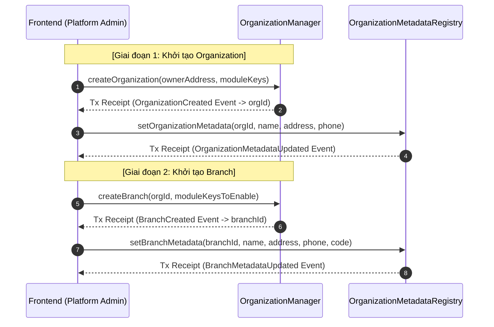

# Luồng khởi tạo Organization & Branch kèm theo Metadata (Platform Admin)

Tài liệu này mô tả chi tiết luồng tích hợp Frontend (FE) dành cho vai trò **PLATFORM_ADMIN_ROLE** (Đội ngũ vận hành/Sale của nền tảng) để thực hiện quy trình khởi tạo khách hàng mới (Organization) và các chi nhánh (Branch) kèm theo việc cập nhật thông tin hiển thị (Metadata) lên on-chain.

---

## 1. Chuẩn bị Địa chỉ Hợp đồng (Contracts Config)

FE cần cấu hình địa chỉ của các hợp đồng lõi sau:

- `SystemAccessControl`: Kiểm tra quyền hạn của Platform Admin.
- `OrganizationManager`: Thực hiện tạo thực thể Core (ID, Owner, Active).
- `OrganizationMetadataRegistry`: Lưu trữ metadata (Tên, địa chỉ, SĐT, code).

---

## 2. Luồng Khởi tạo Organization (Tổ chức)

Quy trình tạo mới một tổ chức (Khách hàng doanh nghiệp/Chủ chuỗi Cyber) diễn ra qua 2 bước giao dịch (transactions) độc lập:

### Bước 2.1: Khởi tạo Core Organization

1. **FE Gửi Giao Dịch**: Gọi hàm `createOrganization` trên hợp đồng `OrganizationManager`.
   ```solidity
   function createOrganization(address owner, bytes32[] calldata moduleKeys) external returns (uint48 organizationId)
   ```
2. **Xác nhận giao dịch**: Giao dịch thành công sẽ phát ra event:
   ```solidity
   event OrganizationCreated(uint48 indexed organizationId, address indexed owner);
   ```
3. **FE xử lý**: Đọc receipt giao dịch để lấy giá trị `organizationId` vừa được tạo ra.

### Bước 2.2: Thiết lập Metadata cho Organization

1. **FE Gửi Giao Dịch**: Sử dụng `organizationId` vừa nhận được để gọi hàm `setOrganizationMetadata` trên hợp đồng `OrganizationMetadataRegistry`.
   ```solidity
   function setOrganizationMetadata(
       uint48 organizationId,
       string calldata name,
       string calldata organizationAddress,
       string calldata phoneNumber
   ) external
   ```
2. **Xác nhận giao dịch**: Giao dịch thành công phát ra event:
   ```solidity
   event OrganizationMetadataUpdated(
       uint48 indexed organizationId,
       string name,
       string organizationAddress,
       string phoneNumber
   );
   ```

---

## 3. Luồng Khởi tạo Branch (Chi nhánh)

Quy trình tạo mới chi nhánh cho một tổ chức diễn ra qua 2 bước giao dịch:

### Bước 3.1: Khởi tạo Core Branch

1. **FE Gửi Giao Dịch**: Gọi hàm `createBranch` trên hợp đồng `OrganizationManager`.
   ```solidity
   function createBranch(uint48 organizationId, bytes32[] calldata moduleKeysToEnable) external returns (uint48 branchId)
   ```
2. **Xác nhận giao dịch**: Giao dịch thành công phát ra event:
   ```solidity
   event BranchCreated(uint48 indexed branchId, uint48 indexed organizationId);
   ```
3. **FE xử lý**: Đọc receipt giao dịch để lấy giá trị `branchId` vừa được tạo ra.

### Bước 3.2: Thiết lập Metadata cho Branch

1. **FE Gửi Giao Dịch**: Sử dụng `branchId` vừa nhận được để gọi hàm `setBranchMetadata` trên hợp đồng `OrganizationMetadataRegistry`.
   ```solidity
   function setBranchMetadata(
       uint48 branchId,
       string calldata name,
       string calldata organizationAddress,
       string calldata phoneNumber,
       string calldata code
   ) external
   ```

   - _Lưu ý: `code` là mã định danh duy nhất (ví dụ: `cyber_q1_hcm`)._
2. **Xác nhận giao dịch**: Giao dịch thành công phát ra event:
   ```solidity
   event BranchMetadataUpdated(
       uint48 indexed branchId,
       string name,
       string organizationAddress,
       string phoneNumber,
       string code
   );
   ```

---

## 4. Sơ đồ Luồng Thực Thi (Sequence Diagram)



---

## 5. Mẫu Code TypeScript (Viem / Ethers) Tích hợp

```typescript
import { createWalletClient, custom, parseAbi } from "viem";
import { mainnet } from "viem/chains";

const client = createWalletClient({
  chain: mainnet,
  transport: custom(window.ethereum),
});

// ABI rút gọn phục vụ minh họa
const abiOrgManager = parseAbi([
  "function createOrganization(address owner, bytes32[] calldata moduleKeys) external returns (uint48)",
  "event OrganizationCreated(uint48 indexed organizationId, address indexed owner)",
]);

const abiMetadataRegistry = parseAbi([
  "function setOrganizationMetadata(uint48 organizationId, string calldata name, string calldata organizationAddress, string calldata phoneNumber) external",
  "event OrganizationMetadataUpdated(uint48 indexed organizationId, string name, string organizationAddress, string phoneNumber)",
]);

async function setupNewOrganization(
  ownerAddress: `0x${string}`,
  moduleKeys: `0x${string}`[],
  metadata: { name: string; address: string; phone: string },
) {
  // 1. Tạo Core Org
  const hash1 = await client.writeContract({
    address: "0xOrganizationManagerAddress",
    abi: abiOrgManager,
    functionName: "createOrganization",
    args: [ownerAddress, moduleKeys],
  });

  // Chờ tx hoàn tất và parse log lấy orgId
  const receipt1 = await publicClient.waitForTransactionReceipt({
    hash: hash1,
  });
  const orgCreatedEvent = receipt1.logs[0]; // Cần lọc log chính xác
  const orgId = orgCreatedEvent.args.organizationId;

  // 2. Set Metadata tương ứng
  const hash2 = await client.writeContract({
    address: "0xMetadataRegistryAddress",
    abi: abiMetadataRegistry,
    functionName: "setOrganizationMetadata",
    args: [orgId, metadata.name, metadata.address, metadata.phone],
  });

  await publicClient.waitForTransactionReceipt({ hash: hash2 });
  console.log(`Đã thiết lập thành công Organization #${orgId} kèm metadata.`);
}
```
