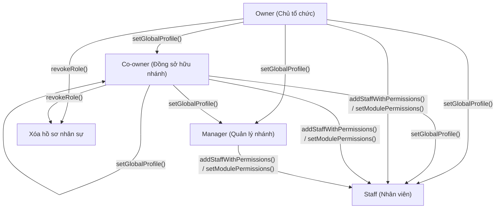

# Luồng Owner Quản Lý Phân Quyền & Bổ Nhiệm Chi Nhánh

Tài liệu này mô tả chi tiết cách **Owner (Chủ tổ chức)** quản lý phân quyền và bổ nhiệm các vai trò **Co-owner**, **Manager**, **Staff** cho từng chi nhánh dựa trên kiến trúc Smart Contract hiện tại trong thư mục [src/core](file:///Users/yuu/Documents/CONTRACTS/organization-contract/src/core).

---

## 1. Cơ Chế Xác Thực Quyền Tối Cao Của Owner

Trong hệ thống, **Owner** của tổ chức không được lưu trữ trong danh sách nhân sự (`staffProfiles`) của từng chi nhánh. Thay vào đó, Owner sở hữu **quyền kiểm soát tối cao (Absolute Bypass)** đối với mọi chi nhánh thuộc tổ chức của họ.

Cơ chế này được thực hiện trong hàm `_hasRoleOrHigher` của [BranchStaffManager.sol](file:///Users/yuu/Documents/CONTRACTS/organization-contract/src/core/BranchStaffManager.sol#L186-L200):

```solidity
function _hasRoleOrHigher(
    address account,
    uint8 minimumRole
) internal view returns (bool) {
    // 1. Owner của Tổ chức (Bypass tuyệt đối mọi quyền)
    uint48 senderOrg = IOrganizationManager(organizationManager)
        .getOrganizationIdByOwner(account);
    if (senderOrg == orgId) return true;

    // 2. Quyền phân cấp tại nhánh
    uint8 role = staffProfiles[account].role;
    if (role != 0 && role <= minimumRole) return true;

    return false;
}
```

### Cách thức hoạt động:

- Khi ví của Owner gọi bất kỳ hàm nào yêu cầu quyền quản trị tại chi nhánh (thông qua modifier `requiresRole`), hợp đồng sẽ gọi chéo sang `OrganizationManager` để kiểm tra xem ví đó có phải là Owner của tổ chức sở hữu chi nhánh này (`orgId`) hay không.
- Nếu đúng, hệ thống trả về `true` ngay lập tức, bỏ qua mọi kiểm tra vai trò lưu ở chi nhánh.

---

## 2. Hệ Thống Vai Trò (Roles) & Phân Cấp Quyền Hạn

Tại mỗi chi nhánh, quyền lực được phân cấp theo thứ tự tăng dần về mặt số học (giá trị role càng nhỏ thì quyền lực càng cao):

| Vai trò                              | Giá Trị Hằng Số (`uint8`) | Người Có Quyền Bổ Nhiệm              | Phạm Vi Quyền Hạn                                                                              |
| :----------------------------------- | :-----------------------: | :----------------------------------- | :--------------------------------------------------------------------------------------------- |
| **Organization Owner**               |   _(Không giới hạn số)_   | **Platform Admin** (khi tạo Org)     | Toàn quyền kiểm soát tất cả các chi nhánh thuộc tổ chức.                                       |
| **Co-owner** (Đồng sở hữu chi nhánh) |            `1`            | **Owner**, **Co-owner**              | Quản lý toàn bộ cấu hình nhân sự, bổ nhiệm Manager/Staff và cấu hình tất cả các module.        |
| **Manager** (Quản lý chi nhánh)      |            `2`            | **Owner**, **Co-owner**              | Thêm mới nhân viên (`Staff`), cấp và điều chỉnh quyền hạn chi tiết trên từng Module nghiệp vụ. |
| **Staff** (Nhân viên)                |            `3`            | **Owner**, **Co-owner**, **Manager** | Thực thi các nghiệp vụ cụ thể dựa trên Bitmask quyền hạn được cấp.                             |

---

## 3. Luồng Quản Lý & Bổ Nhiệm Nhân Sự (Quy trình chi tiết)

### 3.1 Sơ đồ luồng phân quyền (Mermaid Flowchart)



---

### 3.2 Các Bước Thực Hiện Trên Smart Contract

#### Bước 1: Xác định địa chỉ hợp đồng quản lý nhân sự của chi nhánh

Để thao tác phân quyền cho Chi nhánh A, Frontend cần truy vấn địa chỉ của hợp đồng `BranchStaffManager` tương ứng thông qua `BranchModuleManager`:

```solidity
address staffManager = BranchModuleManager.getBranchStaffManager(branchId);
```

#### Bước 2: Bổ nhiệm vai trò Co-owner hoặc Manager (Chỉ Owner & Co-owner thực hiện)

Owner gọi hàm `setGlobalProfile` trên `BranchStaffManager` để bổ nhiệm:

```solidity
function setGlobalProfile(
    address staff,
    uint8 role,
    uint248 globalPerms
) external;
```

- **Bổ nhiệm Co-owner:** Truyền `role = 1 (ROLE_CO_OWNER)`. Tham số `globalPerms` truyền `0` vì Co-owner có quyền bypass các check quyền Global.
- **Bổ nhiệm Manager:** Truyền `role = 2 (ROLE_MANAGER)`. Tham số `globalPerms` truyền `0`.

#### Bước 3: Thêm nhân viên (Staff) và cấp quyền nhanh (Owner, Co-owner, Manager thực hiện)

Để tối ưu phí gas và tăng trải nghiệm sử dụng, hệ thống cung cấp hàm tích hợp cho phép thêm nhân viên mới và cấp toàn bộ quyền nghiệp vụ chỉ trong 1 giao dịch:

```solidity
function addStaffWithPermissions(
    address staff,
    uint248 globalPerms,
    bytes32[] calldata moduleKeys,
    uint256[] calldata modulePermBitmasks
) external;
```

- **`globalPerms`**: Bitmask quyền dùng chung của chi nhánh (ví dụ: `GLOBAL_PERM_CASHIER` để thu ngân, `GLOBAL_PERM_REPORTS` để xem báo cáo tổng).
- **`moduleKeys`**: Danh sách mã định danh của các Module (Ví dụ: `keccak256("MODULE_MEOS")`).
- **`modulePermBitmasks`**: Bitmask tương ứng cho từng Module nghiệp vụ (ví dụ: quyền quản lý máy trạm, cấu hình VIP,...).

#### Bước 4: Điều chỉnh quyền hạn Module nghiệp vụ của Staff (Owner, Co-owner, Manager thực hiện)

Khi cần điều chỉnh quyền hạn cụ thể của một nhân viên đối với một phân hệ (ví dụ: tăng/giảm quyền trong Module MEOS):

```solidity
function setModulePermissions(
    address staff,
    bytes32 moduleKey,
    uint256 permissions
) external;
```

#### Bước 5: Bãi nhiệm / Xóa nhân sự khỏi chi nhánh (Chỉ Owner & Co-owner thực hiện)

Khi nhân sự nghỉ việc hoặc luân chuyển công tác, cần thu hồi hoàn toàn quyền truy cập:

```solidity
function revokeRole(address staff) external;
```

- Hàm này sẽ xóa bản ghi của `staff` trong mapping `staffProfiles` (`delete staffProfiles[staff]`).
- Mặc dù dữ liệu phân quyền module (`modulePerms`) vẫn lưu trên blockchain để tiết kiệm gas cho giao dịch xóa, nhưng do `role` của nhân viên đó đã trở về `0`, mọi hàm kiểm tra quyền hạn (`hasGlobalPermission`, `hasModulePermission`) sẽ tự động từ chối truy cập ngay lập tức.
