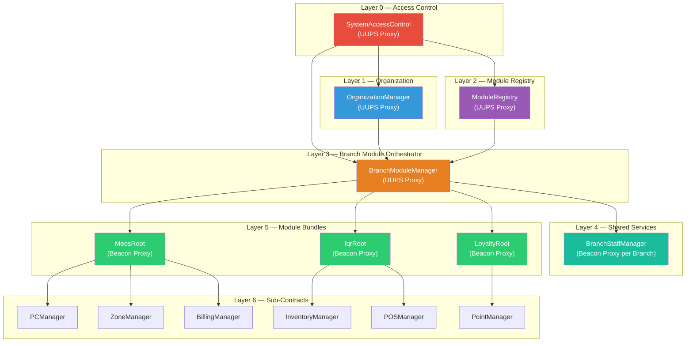
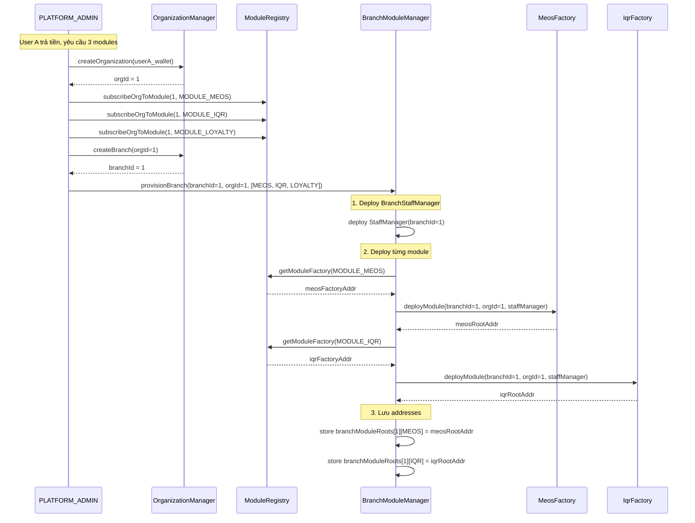
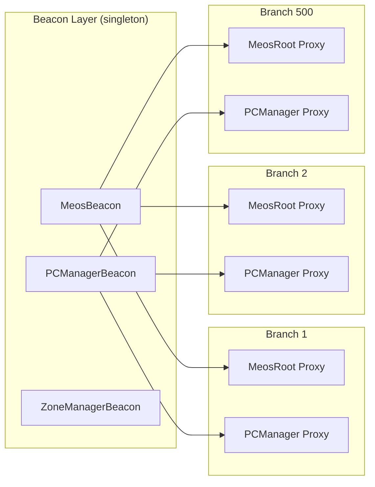

# Thiết Kế Kiến Trúc — Multi-Tenant Module Platform

## 1. Tổng Quan Yêu Cầu

| Yêu cầu              | Mô tả                                                                    |
| -------------------- | ------------------------------------------------------------------------ |
| **Multi-tenant**     | Mỗi Organization sở hữu nhiều Branch, dữ liệu tách biệt                  |
| **Modular**          | 3 module hiện tại (IQR, MEOS, Loyalty), mở rộng tương lai                |
| **Module = Bundle**  | 1 module = nhiều sub-contract (VD: MEOS = PCManager + ZoneManager + ...) |
| **Branch Isolation** | Mỗi branch có bộ contract proxy riêng biệt                               |
| **Shared HR Layer**  | Tầng quản lý nhân sự dùng chung cho tất cả module trong 1 branch         |
| **Data Aggregation** | Organization owner query data tổng hợp từ các branch                     |
| **Upgradeable**      | Upgrade toàn bộ branch cùng module cùng lúc                              |

---

## 2. Kiến Trúc 6 Tầng



---

## 3. Design Patterns Sử Dụng

### 3.1 Beacon Proxy Pattern — Upgrade Hàng Loạt

**Tại sao?** Khi bạn có 500 branch đều bật MEOS → cần upgrade tất cả cùng lúc bằng 1 transaction.

```
MeosBeacon (lưu implementation address)
    │
    ├── Branch1/MeosRoot (BeaconProxy) ─→ đọc logic từ Beacon
    ├── Branch2/MeosRoot (BeaconProxy) ─→ đọc logic từ Beacon
    └── Branch500/MeosRoot (BeaconProxy) ─→ đọc logic từ Beacon
```

```solidity
// Upgrade toàn bộ MEOS:
meosBeacon.upgradeTo(newMeosLogicAddress);
// → 500 branch tự động dùng logic mới
```

> [!IMPORTANT]
> Mỗi module type có 1 Beacon riêng. Mỗi sub-contract type cũng có 1 Beacon riêng. Tổng cộng nếu MEOS có 4 sub-contracts → cần 4 Beacon + 1 MeosRoot Beacon = 5 Beacons cho module MEOS.

---

### 3.2 Module Registry Pattern — Đăng Ký Module

**Tại sao?** Cần một nơi trung tâm biết hệ thống có bao nhiêu module, mỗi module cần deploy những beacon nào.

```solidity
// Đăng ký module MEOS vào registry
moduleRegistry.registerModule(
    MODULE_MEOS,                    // bytes32 key
    meosModuleFactoryAddress        // factory biết cách deploy bundle
);
```

---

### 3.3 Module Root Pattern — Entry Point Cho Module Bundle

**Tại sao?** 1 module = nhiều sub-contract. Cần 1 "root" contract làm entry point, lưu địa chỉ tất cả sub-contracts.

```solidity
contract MeosRoot {
    address public pcManager;
    address public zoneManager;
    address public billingManager;
    address public playTimeManager;

    // Frontend chỉ cần gọi 1 hàm:
    function getAddresses() external view returns (
        address, address, address, address
    ) { ... }
}
```

---

### 3.4 Shared Service Pattern — Tầng Chung Nhân Sự

**Tại sao?** Mọi module đều cần quản lý nhân sự (nhân viên, vị trí, ca làm). Nếu mỗi module tự implement → duplicate code + data inconsistency.

```
Branch 1
    ├── BranchStaffManager ←── SHARED (1 per branch)
    │       ├── employees
    │       ├── positions (Manager, Cashier, Technician)
    │       ├── shifts
    │       └── permissions per position
    │
    ├── MeosRoot ──────────── uses StaffManager
    ├── IqrRoot ───────────── uses StaffManager
    └── LoyaltyRoot ──────── uses StaffManager
```

---

## 4. Chi Tiết Thiết Kế Contract

### 4.1 ModuleRegistry (Layer 2)

```solidity
contract ModuleRegistry is Initializable, UUPSUpgradeable {

    struct ModuleDefinition {
        bytes32 key;                 // MODULE_MEOS, MODULE_IQR, ...
        string  name;                // "MEOS", "IQR", ...
        address factory;             // MeosModuleFactory address
        bool    active;
        bool    exists;
    }

    // Lưu trữ
    mapping(bytes32 => ModuleDefinition) public modules;
    bytes32[] public moduleKeys;     // Danh sách tất cả module keys

    // Organization subscription: org nào mua module nào
    mapping(uint256 => EnumerableSet.Bytes32Set) internal orgModules;

    // Functions
    function registerModule(bytes32 key, string calldata name, address factory) external;
    function subscribeOrgToModule(uint256 orgId, bytes32 moduleKey) external;
    function unsubscribeOrgFromModule(uint256 orgId, bytes32 moduleKey) external;
    function isOrgSubscribed(uint256 orgId, bytes32 moduleKey) external view returns (bool);
    function getOrgModules(uint256 orgId) external view returns (bytes32[] memory);
}
```

**Ý nghĩa:**

- `registerModule` — OPS_ADMIN đăng ký module mới vào hệ thống
- `subscribeOrgToModule` — PLATFORM_ADMIN kích hoạt module cho org khi org trả tiền
- Factory address cho phép hệ thống biết cách deploy module đó

---

### 4.2 BranchModuleManager (Layer 3) — Orchestrator Chính

```solidity
contract BranchModuleManager is Initializable, UUPSUpgradeable {

    // branchId => moduleKey => ModuleRoot address
    mapping(uint256 => mapping(bytes32 => address)) public branchModuleRoots;

    // branchId => BranchStaffManager address
    mapping(uint256 => address) public branchStaffManagers;

    // branchId => list of enabled module keys
    mapping(uint256 => EnumerableSet.Bytes32Set) internal branchEnabledModules;

    /// @dev Deploy Shared Staff Manager + Modules cho Branch
    function provisionBranch(
        uint256 branchId,
        uint256 orgId,
        bytes32[] calldata moduleKeys
    ) external onlyPlatformAdmin {
        // 1. Validate branch exists + org owns branch
        // 2. Validate org subscribed to all requested modules
        // 3. Deploy BranchStaffManager (shared)
        // 4. For each moduleKey → call factory.deploy(branchId, orgId, staffManager)
        // 5. Store module root addresses
    }

    /// @dev Thêm module cho branch đang hoạt động
    function enableModule(
        uint256 branchId,
        bytes32 moduleKey
    ) external onlyPlatformAdmin returns (address moduleRoot);

    /// @dev Tắt module (không xóa data, chỉ disable)
    function disableModule(uint256 branchId, bytes32 moduleKey) external;

    /// @dev Query: lấy tất cả địa chỉ module của 1 branch
    function getBranchModules(uint256 branchId)
        external view returns (bytes32[] memory keys, address[] memory roots);

    /// @dev Query: lấy địa chỉ module root cụ thể
    function getModuleRoot(uint256 branchId, bytes32 moduleKey)
        external view returns (address);
}
```

---

### 4.3 Module Factory Pattern

Mỗi module type có 1 factory riêng. Factory biết cách deploy toàn bộ bundle.

```solidity
interface IModuleFactory {
    /// @dev Deploy toàn bộ bundle cho 1 branch
    /// @return moduleRoot Địa chỉ root contract của module
    function deployModule(
        uint256 branchId,
        uint256 orgId,
        address staffManager       // shared staff manager
    ) external returns (address moduleRoot);
}
```

**Ví dụ MeosModuleFactory:**

```solidity
contract MeosModuleFactory is IModuleFactory {
    // Beacons cho từng sub-contract
    address public meosRootBeacon;
    address public pcManagerBeacon;
    address public zoneManagerBeacon;
    address public billingManagerBeacon;

    function deployModule(
        uint256 branchId,
        uint256 orgId,
        address staffManager
    ) external returns (address moduleRoot) {

        // 1. Deploy sub-contracts (Beacon Proxies)
        address pcManager = address(new BeaconProxy(
            pcManagerBeacon,
            abi.encodeCall(IPCManager.initialize, (branchId, staffManager))
        ));

        address zoneManager = address(new BeaconProxy(
            zoneManagerBeacon,
            abi.encodeCall(IZoneManager.initialize, (branchId, staffManager))
        ));

        address billingManager = address(new BeaconProxy(
            billingManagerBeacon,
            abi.encodeCall(IBillingManager.initialize, (branchId, staffManager))
        ));

        // 2. Deploy MeosRoot (Beacon Proxy) — root giữ references
        moduleRoot = address(new BeaconProxy(
            meosRootBeacon,
            abi.encodeCall(IMeosRoot.initialize, (
                branchId, orgId, staffManager,
                pcManager, zoneManager, billingManager
            ))
        ));
    }
}
```

---

### 4.4 BranchStaffManager — Tầng Chung Nhân Sự

```solidity
contract BranchStaffManager {
    uint256 public branchId;

    // ====== POSITIONS (Vị trí) ======
    struct Position {
        string name;           // "Manager", "Cashier", "Technician"
        bytes32[] permissions;  // ["CAN_VIEW_REPORTS", "CAN_MANAGE_PC", ...]
        bool active;
    }
    mapping(uint256 => Position) public positions;

    // ====== EMPLOYEES (Nhân viên) ======
    struct Employee {
        address wallet;
        uint256 positionId;
        bool active;
    }
    mapping(uint256 => Employee) public employees;
    mapping(address => uint256) public walletToEmployeeId;

    // ====== SHIFTS (Ca làm) ======
    struct Shift {
        uint256 employeeId;
        uint256 startTime;
        uint256 endTime;
        bool active;
    }

    // ====== PERMISSION CHECK (Dùng bởi tất cả modules) ======
    function hasPermission(
        address wallet,
        bytes32 permission
    ) external view returns (bool);

    function requirePermission(
        address wallet,
        bytes32 permission
    ) external view; // revert nếu không có quyền
}
```

**Cách module sử dụng:**

```solidity
contract PCManager {
    BranchStaffManager public staffManager;

    modifier onlyWithPermission(bytes32 perm) {
        staffManager.requirePermission(msg.sender, perm);
        _;
    }

    function addPC(string calldata name)
        external onlyWithPermission(PERMISSION_MANAGE_PC)
    {
        // logic...
    }
}
```

---

## 5. Luồng Deploy Chi Tiết

### 5.1 Luồng Tạo Organization + Branch + Modules



### 5.2 Kết Quả Sau Deploy

```
Branch 1 (bật tất cả):
├── BranchStaffManager: 0xAAA...
├── MODULE_MEOS:
│   └── MeosRoot: 0xBBB...
│       ├── pcManager: 0xCCC...
│       ├── zoneManager: 0xDDD...
│       └── billingManager: 0xEEE...
├── MODULE_IQR:
│   └── IqrRoot: 0xFFF...
│       ├── inventoryManager: 0x111...
│       └── posManager: 0x222...
└── MODULE_LOYALTY:
    └── LoyaltyRoot: 0x333...
        └── pointManager: 0x444...

Branch 2 (chỉ MEOS + LOYALTY):
├── BranchStaffManager: 0x555...
├── MODULE_MEOS:
│   └── MeosRoot: 0x666...
│       ├── pcManager: 0x777...
│       ├── zoneManager: 0x888...
│       └── billingManager: 0x999...
└── MODULE_LOYALTY:
    └── LoyaltyRoot: 0xAAA...
        └── pointManager: 0xBBB...
```

---

## 6. Upgrade Strategy

### Beacon Upgrade — Upgrade 1 lần, áp dụng tất cả



```solidity
// OPS_ADMIN upgrade PCManager logic cho TẤT CẢ branches:
pcManagerBeacon.upgradeTo(newPCManagerLogicV2);
// → 500 branches tự động dùng logic mới trong 1 tx
```

---

## 7. Data Aggregation — Organization Query

```solidity
// Frontend flow:
// 1. Lấy danh sách branch của org
uint256[] memory branches = orgManager.getOrganizationBranches(orgId);

// 2. Với mỗi branch, lấy module root
for (uint i = 0; i < branches.length; i++) {
    address meosRoot = branchModuleManager.getModuleRoot(branches[i], MODULE_MEOS);

    // 3. Từ root, lấy sub-contract addresses
    address pcManager = IMeosRoot(meosRoot).pcManager();

    // 4. Query data
    uint256 pcCount = IPCManager(pcManager).totalPCs();
}
```

> [!TIP]
> Nên tạo thêm 1 **BranchDataAggregator** (view-only contract) để Organization owner gọi 1 lần lấy tất cả data thay vì gọi từng contract.

---

## 8. Cấu Trúc Thư Mục Đề Xuất

```
src/
├── core/                                    # Layer 0-3
│   ├── SystemAccessControl.sol              # ✅ Done
│   ├── OrganizationManager.sol              # ✅ Done
│   ├── ModuleRegistry.sol                   # 🔜 Phase 2
│   ├── BranchModuleManager.sol              # 🔜 Phase 2
│   ├── constants/
│   │   ├── RoleHashes.sol                   # ✅ Done
│   │   └── ModuleKeys.sol                   # 🔜 MODULE_MEOS, MODULE_IQR,...
│   ├── interfaces/
│   │   ├── ISystemAccessControl.sol         # ✅ Done
│   │   ├── IOrganizationManager.sol         # ✅ Done
│   │   ├── IModuleRegistry.sol              # 🔜
│   │   ├── IBranchModuleManager.sol         # 🔜
│   │   └── IModuleFactory.sol               # 🔜
│   └── storage/
│       ├── OrganizationManagerStorage.sol   # ✅ Done
│       ├── ModuleRegistryStorage.sol        # 🔜
│       └── BranchModuleManagerStorage.sol   # 🔜
│
├── shared/                                  # Layer 4 — Shared Services
│   ├── BranchStaffManager.sol               # 🔜 Phase 3
│   ├── interfaces/
│   │   └── IBranchStaffManager.sol
│   ├── types/
│   │   └── StaffTypes.sol                   # Position, Employee, Shift
│   └── constants/
│       └── PermissionKeys.sol               # PERMISSION_MANAGE_PC,...
│
├── modules/                                 # Layer 5-6
│   ├── meos/
│   │   ├── MeosModuleFactory.sol            # 🔜 Phase 4
│   │   ├── MeosRoot.sol                     # Entry point
│   │   ├── PCManager.sol                    # Sub-contract
│   │   ├── ZoneManager.sol
│   │   ├── BillingManager.sol
│   │   └── interfaces/
│   │       ├── IMeosRoot.sol
│   │       └── IPCManager.sol
│   ├── iqr/
│   │   ├── IqrModuleFactory.sol
│   │   ├── IqrRoot.sol
│   │   ├── InventoryManager.sol
│   │   ├── POSManager.sol
│   │   └── interfaces/
│   └── loyalty/
│       ├── LoyaltyModuleFactory.sol
│       ├── LoyaltyRoot.sol
│       ├── PointManager.sol
│       └── interfaces/
│
├── proxies/
│   └── BranchBeaconProxy.sol                # ✅ Done
│
└── types/
    ├── OrganizationTypes.sol                # ✅ Done
    ├── BranchTypes.sol                      # ✅ Done
    └── ModuleTypes.sol                      # 🔜
```

---

## 9. Phân Pha Triển Khai

### Phase 2 — Module Registry + Branch Module Manager

```
Mục tiêu: Có thể đăng ký module và provision branch
Files cần tạo:
  - ModuleKeys.sol
  - IModuleFactory.sol
  - IModuleRegistry.sol + ModuleRegistryStorage.sol + ModuleRegistry.sol
  - IBranchModuleManager.sol + BranchModuleManagerStorage.sol + BranchModuleManager.sol
Scripts:
  - DeployModuleRegistry.s.sol
  - DeployBranchModuleManager.s.sol
```

### Phase 3 — Shared Staff Manager

```
Mục tiêu: Tầng quản lý nhân sự dùng chung
Files cần tạo:
  - StaffTypes.sol + PermissionKeys.sol
  - IBranchStaffManager.sol + BranchStaffManager.sol
  - BranchStaffBeacon deploy
```

### Phase 4 — Module Bundles (MEOS first)

```
Mục tiêu: Deploy được MEOS bundle hoàn chỉnh cho 1 branch
Files cần tạo:
  - MeosRoot.sol + PCManager.sol + ZoneManager.sol + BillingManager.sol
  - MeosModuleFactory.sol
  - Deploy 4 Beacons + 1 Factory
```

### Phase 5 — IQR + Loyalty Modules

```
Mục tiêu: Thêm 2 modules còn lại
```

### Phase 6 — Data Aggregation

```
Mục tiêu: Organization query data tổng hợp
Files:
  - BranchDataAggregator.sol (view-only)
```

---

## 10. Các Quyết Định Thiết Kế Quan Trọng

> [!WARNING]
>
> ### Cần xác nhận từ bạn trước khi implement:

### Q1: BranchStaffManager deploy như thế nào?

**Option A** — Beacon Proxy (upgrade chung tất cả branch)

- ✅ Upgrade 1 lần
- ❌ Không linh hoạt per-branch

**Option B** — UUPS Proxy (mỗi branch upgrade riêng)

- ✅ Linh hoạt
- ❌ Phải upgrade từng branch

**Đề xuất: Option A (Beacon)** — vì StaffManager logic nên đồng nhất.

---

### Q2: Ai có quyền quản lý nhân sự trong branch?

**Option A** — Organization Owner quản lý tất cả branch
**Option B** — Branch Manager (do Org Owner chỉ định) quản lý branch đó
**Option C** — Cả hai (Org Owner + Branch Manager)

**Đề xuất: Option C** — Org Owner có full quyền, Branch Manager có quyền giới hạn.

---

### Q3: Khi tắt module cho branch, xử lý data thế nào?

**Option A** — Soft disable (giữ data, chỉ disable function calls)
**Option B** — Hard disable (xóa mapping, mất reference)

**Đề xuất: Option A** — data on-chain không nên xóa, chỉ disable.

---

### Q4: Gas cost cho provisionBranch

Deploy 1 branch với 3 modules + shared staff = khoảng 8-12 contract proxies.
Ước tính gas: ~3-5M gas.

**Option A** — Deploy tất cả trong 1 tx (đơn giản, gas cao)
**Option B** — Deploy từng module riêng (nhiều tx, gas thấp per tx)

**Đề xuất: Option B** — tách thành `provisionBranch()` + `enableModule()` riêng lẻ.
