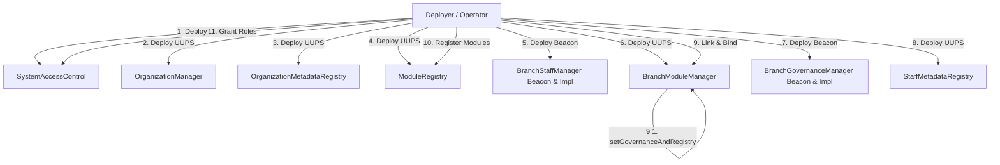

# Hướng dẫn Luồng Deploy Hệ thống (Deployment Flow)

Tài liệu này hướng dẫn chi tiết quy trình deploy hệ thống Modular Organization, đặc biệt là cách thức xử lý việc thiết lập hai chiều và giải quyết rủi ro phụ thuộc vòng (Circular Dependency) của kiến trúc 3-contract mới.

---

## 1. Biểu đồ Luồng Deploy Tuần tự



---

## 2. Các Bước Deploy Chi Tiết & Giải thích Kỹ Thuật

### Bước 1: Deploy các hợp đồng Cốt lõi & Phân quyền
1. **`SystemAccessControl` (SAC)**: Khởi tạo với vai trò quản trị viên cấp cao. SAC chịu trách nhiệm phân quyền hệ thống (`Platform Admin`, `Ops Admin`, `Default Admin`).
2. **`OrganizationManager` (OM)**: Quản lý vòng đời của các Tổ chức (Organization) và Chi nhánh (Branch).
3. **`OrganizationMetadataRegistry` (OMR)**: Lưu trữ Metadata tương ứng cho từng Tổ chức.
4. **`ModuleRegistry` (MR)**: Đăng ký danh sách các Module Factory được phép hoạt động trên hệ thống (ví dụ: `MEOS`, `IQR`, `Loyalty`).

### Bước 2: Chuẩn bị Beacon cho nhân sự chi nhánh
5. **`BranchStaffManager` (BSM) Beacon**: 
   - Deploy hợp đồng implementation `BranchStaffManager` (chứa logic RBAC).
   - Deploy hợp đồng `UpgradeableBeacon` để quản lý việc nâng cấp cho tất cả các chi nhánh sau này.

### Bước 3: Deploy Orchestrator & Governance (Giải quyết Phụ thuộc vòng)
Để giải quyết bài toán "Con gà và Quả trứng" (BSM cần địa chỉ Governance, và Governance cần địa chỉ BSM khi khởi tạo), quy trình deploy thực hiện giải pháp **Lazy-Binding**:

6. **`BranchModuleManager` (BMM) (Khởi tạo đợt 1)**:
   - Deploy proxy BMM.
   - Gọi `initialize` BMM với địa chỉ `SAC`, `OM`, `MR` và `BSM Beacon`. 
   - *Lưu ý*: Lúc này `governanceBeacon` và `StaffMetadataRegistry` vẫn chưa được gắn (địa chỉ mặc định là `0x0`).
7. **`BranchGovernanceManager` (BGM) Beacon**:
   - Deploy hợp đồng implementation `BranchGovernanceManager` (chứa logic Proposals & Voting).
   - Deploy `UpgradeableBeacon` cho BGM.
8. **`StaffMetadataRegistry` (SMR)**:
   - Deploy proxy SMR.
   - Gọi `initialize` SMR và liên kết tới `BMM` để phục vụ việc xác thực chéo địa chỉ Governance khi cập nhật thông tin.
9. **Lazy-Binding & Linkage (Khởi tạo đợt 2)**:
   - Gọi hàm đặc quyền `setGovernanceAndRegistry(govBeaconAddress, smrProxyAddress)` trên `BMM`.
   - Lúc này BMM đã có đầy đủ thông tin để provision chi nhánh. Khi có chi nhánh mới được tạo:
     1. BMM deploy BSM Proxy qua Beacon.
     2. BMM deploy BGM Proxy qua Beacon (truyền địa chỉ BSM proxy vào).
     3. BMM gọi BSM để set địa chỉ BGM Proxy (`setBranchGovernanceManager`) và set địa chỉ `StaffMetadataRegistry` (`setStaffMetadataRegistry`).
     4. Luồng liên kết khép kín và an toàn hoàn toàn mà không bị deadlock compile-time hay initialization loop.

### Bước 4: Đăng ký Module & Cấp quyền vận hành
10. **Đăng ký Module**: Đăng ký các module Factory tương ứng (ví dụ: `MeosFactory`, `IqrFactory`) vào `ModuleRegistry`.
11. **Ủy quyền vận hành**: Cấp quyền `PLATFORM_ADMIN_ROLE` cho các hợp đồng thông minh proxy tương tác chéo nhằm cho phép chúng gọi lẫn nhau một cách an toàn.

---

## 3. Nhật ký Output (deployments/system_deploy.json)
Sau khi chạy script deploy bằng lệnh:
```bash
forge script script/DeployFullSystem.s.sol --rpc-url <YOUR_RPC> --broadcast
```
Hệ thống tự động kết xuất tệp JSON tại `deployments/system_deploy.json` lưu giữ thông tin địa chỉ phục vụ frontend:
* `SystemAccessControl` (Impl & Proxy)
* `OrganizationManager` (Impl & Proxy)
* `OrganizationMetadataRegistry` (Impl & Proxy)
* `ModuleRegistry` (Impl & Proxy)
* `BranchModuleManager` (Impl & Proxy)
* `StaffMetadataRegistry` (Impl & Proxy)
* `BranchGovernanceBeacon` (Beacon điều khiển biểu quyết nhánh)
* `OrganizationReader` (Hợp đồng view dữ liệu tổng hợp)
